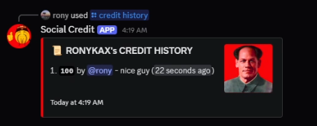

# Social Credit
A Discord app to manage your social credit

## Commands
- `/credit add [user]` give or take social credit from a user.
- `/credit check [user]` check a user's social credit score
- `/credit history [user]` view a user's social credit history
- `/credit leaderboard` view the global social credit leaderboard

## Getting started
1. clone the repo
2. create a `.env` file and fill in the values (refer to `[.env.example](/.env.example)`)
3. run `bun run .`

## Screenshots

